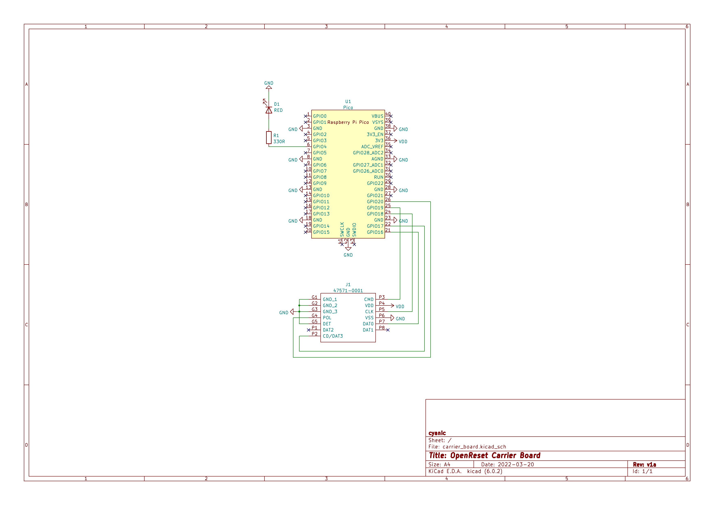
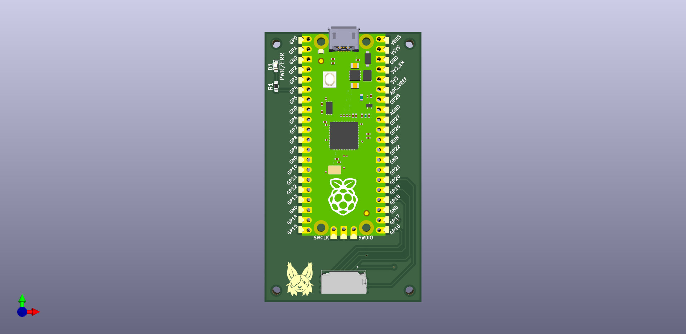

OpenReset Project
=================

This project is designed to allow you to easily reset your card with a
standalone device. No need to connect to a computer to use (in fact you can't
read the card from a computer using this device).

DIY hardware
------------

It is easy to build your own OpenReset from loose parts.

### Bill of materials

To build your own OpenReset, you will need the following:

- 1x Raspberry Pi Pico
- 1x microSD card breakout board (suggested model TBD)
- 1x Red LED
- 1x Resistor (for current limiting the LED; please calculate the value based
  on your LED's datasheet, but in general a 330Ω resistor will work)
- 1x Toggle switch or button if your breakout board does not have card detect
  broken out
- 1x Breadboard (optional)
- Hookup wires

### Hardware connection

1. Connect the `3V3` pin on the Pico to your positive power rail and any `GND`
   pin to your ground rail.
2. Connect the microSD card breakout to the Pico as follows:
   - Pico pin 21 to `DAT0` or `MISO`
   - Pico pin 22 to `DAT3` or `CS`
   - Pico pin 24 to `CLK` or `CLK`
   - Pico pin 25 to `CMD` or `MOSI`
   - Pico pin 26 to card detect. Note, if your breakout board does not have a
     card detect pin, you can connect a toggle switch or button to pin 26, and
     connect the other side to ground.
3. Connect the red LED to Pico pin 2 (note the anode should be connect to the
   Pico), and connect resistor to the LED (cathode side). Connect the other end
   of the resistor to ground.

Carrier board
-------------

Alternatively, you can have a carrier board fabbed and solder the Pi Pico to it
along with a few other components.

Board design files are in the [carrier_board](carrier_board) directory. Gerbers
are available in the [carrier_board/gerber](carrier_board/gerber) directory,
and are available as a [ZIP file](carrier_board/gerber/openreset_carrier_board_v1.zip).

### Bill of materials

- 1x Raspberry Pi Pico (`U1`) ([Official resellers](https://www.raspberrypi.com/products/raspberry-pi-pico/#find-reseller))
- 1x Molex 0475710001 push-pull microSD card connector (`J1`) ([Digikey](https://www.digikey.ca/en/products/detail/molex/0475710001/3262277))
- 1x 0603 Red LED (`D1`)
- 1x 0603 Resistor (`R1`) (for current limiting the LED; please calculate the
  value based on your LED's datasheet, but in general a 330Ω resistor will work)

Software setup
--------------

1. Install MicroPython on to your Pi Pico
   - Download a recent build from [here](https://micropython.org/download/rp2-pico/)
   - Hold the `BOOTSEL` button on your Pico, then plug the Pico into your
     computer while still holding the button. You can release the button
     once the Pico shows up on your computer as a USB drive.
   - Drag the .uf2 firmware you have downloaded to the USB drive, and the
     Pico will install the firmware and reboot
2. Upload the code in the [firmware](firmware) directory to the Pico
   - I use [Thonny](https://thonny.org/). After you install it, open it up
     and click the button at the bottom right of the screen. Select
     `MicroPython (Raspberry Pi Pico)`.
   - Open up each file in the firmware directory, and select `File ->
     Save copy...` from the menu strip. Click `Raspbery Pi Pico` when asked
     where to save to. Type in the name of the file in the `File name` box,
     and click `OK`.
3. Replug the Pico and verify the code is installed
   - The red LED should be lit

Usage
-----

The board is easy to use. All you have to do is insert your card and the device
will automatically perform the erase. The red LED will always be on to indicate
power, and the green LED on the Pi Pico will light up when the erase is in
progress. After the erase is completed, the green LED will extinguish. If there
is an error, the red LED will blink off a number of times to indicate the error.

- 1 time: wrong card type, check you are using the correct card
- 2 times: wrong flash chip; if you are sure your card is genuine, file an
  issue in this repo
- 3 times: card is not responding as expected

There are messages printed to UART if you need more info on troubleshooting.
I suggest loading the code up in Thonny and checking the shell for the
messages.

If your are using a DIY build and your microSD breakout board does not have a
card detect pin, then you can use the switch/button alternative. Flip the
switch or hold the button after you have inserted a card. The process will
complete and the red LED will flash if there are errors. If you are using a
button, make sure to hold the button until the error has finished blinking, if
applicable. Flip the switch again or release the button before inserting the
next card.
